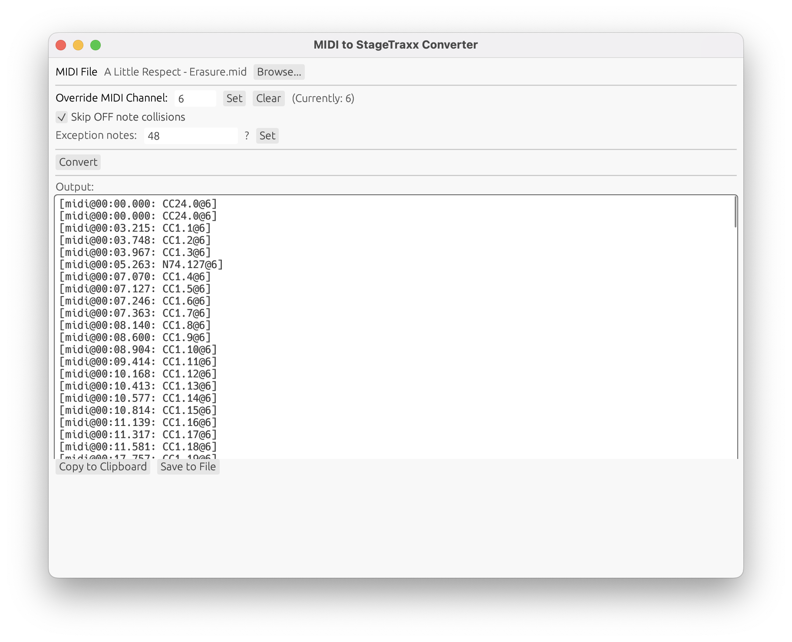

# MIDI to StageTraxx Converter

A tool for converting MIDI files into StageTraxx-compatible format. Why?

My band uses backing tracks with [StageTraxx 4](https://stagetraxx.com). StageTraxx can
also emit midi changes at specific instants in a song which we can use to control lights,
or change patches & effects on MIDI compatible gear.

I use Logic to construct a MIDI track that contains the changes we need, lined up
precisely to the track. Then I export this track as a `.mid` file.

## Stage Traxx MIDI syntax

Stage Traxx supports sending time-based midi messages with a simple text format that
you write in the lyrics editor, like this:

```
[midi@00:00.420: N24.127@4]
[midi@00:01.681: N48.127@4]
[midi@00:01.751: N48.0@4]
[midi@00:02.101: N48.127@4]
```

When playback reaches the time specified, the messages are sent.

## Stage Traxx 4 MIDI file support

The StageTraxx 4 introduced MIDI file support, so this tool may not be necessary, there are cases where you still may want to have this in text format, 
which makes it easier to _see_ that midi changes are present on a track, and also to enable copy/pasting or slight adjustments on the fly.

## What midi2stagetraxx Does

This tool which reads MIDI files and convertsx it to a set of StageTraxx-compatible messages that you can copy/paste into the Lyrics editor in Stage Traxx.



## Two Flavors

- A gui application that runs on macOS, Linux, or Windows.
- A command-line application that runs in a terminal.

If you aren't a developer or aren't familiar with the Rust toolchain,
check the [Releases](https://github.com/subdigital/midi2stagetraxx/releases) page
and download the latest release for your operating system.

If you'd like to build from source, read on...

## Project Structure

This is a [Rust](https://www.rust-lang.org/) workspace with three crates:

- **`core/`** - Shared library with MIDI processing logic
- **`cli/`** - Command-line interface
- **`gui/`** - Native GUI application (using egui)

## Building

```bash
# Build everything
cargo build

# Build release versions
cargo build --release
```

## Running

### CLI Version
```bash
# Run from workspace root
cargo run -p midi2stagetraxx-cli -- -m your_file.mid

# Or directly
./target/debug/midi2stagetraxx -m your_file.mid

# With options
./target/debug/midi2stagetraxx -m your_file.mid --skip-off-note-collisions --off-collision-exceptions 48,64
```

### GUI Version
```bash
# Run from workspace root
cargo run -p midi2stagetraxx-gui

# Or directly
./target/debug/midi2stagetraxx-gui
```

## CLI Options

- `-m, --midi-file <FILE>` - MIDI file to convert (required)
- `-o, --override-midi-channel <CHANNEL>` - Override MIDI channel for all notes and CC changes
- `--skip-off-note-collisions` - Skip OFF notes that arrive at the same time as ON notes
- `--off-collision-exceptions <NOTES>` - Comma-separated list of MIDI note numbers that should never have their OFF events skipped

## Development

To work on a specific crate:
```bash
cd core  # or cli, gui
cargo build
cargo test
```

## Changelog

- `0.1.0` Initial release
- `0.2.0` Adds PC (program change) message support
